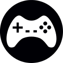

#Godot-School

Este repositorio irá alojando mini-proyectos de videojuegos hechos
con la herramienta **Godot Engine**.

Trataré de hacerlos de forma educativa para facilitar que se pueda
aprender de ellos. Cada videojuego irá acompañado de un documento, que
a modo de guía/resumen contendrá los pasos que se van realizando.

A medida que surjan preguntas se irán detallando las partes de los documentos
que más se necesiten.

¡Muchas gracias!

#Para empezar

Para descargar este repositorio la primera vez, hacemos:
```
git clone https://github.com/dvarrui/godot-school.git
```

Para actualizar cada día, hacemos:
```
cd godot-school
git pull
```

#Instalación de GodotEngine

El proceso de instalación es muy sencillo:
* [Descargamos el programa](http://www.godotengine.org/download) de la página web.
* Descomprimimos y ya está listo para usarlo.
* Conviene descargarse también:
    * Templates (Esto sirve para poder exportar el juego a otras plataformas)
    * Demos and examples (Es conveniente mirar los ejemplos para ver qué se puede hacer con Godot).

#Más información

Los documentos están el el directorio `docs`, y los juegos en el directorio `games`.

* [Game 01 - Shooter](./docs/01-shooter/README.md)
* [Game 02 - TilesMap](./docs/02-tilesmap/README.md)
* [Game 03 - Platforms](./docs/03-platforms/README.md)
* [Game 04 - 3Dobjects](./docs/04-3Dobjects/README.md)
