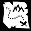

#Juego de Tilesmap

Vamos a crear una versión didáctica de un juego con un mapa 2D.

Créditos:

* Inspirado en [dynadungeos](https://github.com/akien-mga/dynadungeons)
* [CREDITOS](./CREDITS.txt)
* Otros proyectos inspiradores:
    * [Pokemon Clone](https://github.com/MarianoGnu/Pokemon-Tutorials)
    * [TD-Godot-Games](https://github.com/TutorialDoctor/TD-Godot-Games)

Esquema de trabajo:

1. Idea
2. Assets
3. Crear mundo/personajes/objetos
4. Lo unimos todos
5. Añadir Scripts
6. Volver al paso 1

#1. Idea

* La idea es empezar creando un simple mapa de tiles 2D, con un jugador que
se mueva por el mapa e interactúe con algún objeto. Elementos:
    * Mapa/tiles (Suelos, paredes, hierba, etc.)
    * Player
    * Objeto (Por ejemplo una caja o un tesoro)
* Creamos una carpeta `03-tilesmap` y dentro creamos un nuevo proyecto Godot.

#2. Assets

* Vamos a usar los diseños (Imágenes) del proyecto [dynadungeos](https://github.com/akien-mga/dynadungeons)
	* Fichero `sprites\tileset.png`
	* Ficheros `sprites\human-orange\*.png`
	* Ficheros `sprites\goblin-brown\*.png`
* Los copiamos en un directorio `sprites` dentro de nuestro proyecto Godot.
    * `03-tilesmap\sprites`

> La parte de crear nuestros propios diseños no se va a tratar en este tutorial.

#3. Crear personajes/objetos

* Empezamos creando el mundo
* luego nuestro player
* y finalmente creamos la caja del tesoro

##3.1 El mundo

El mundo será un mapa de tiles 2D. Lo creamos en 3 pasos:
1. Creamos un conjunto de celdas (tiles) usando sprites.
2. Convertimos el conjunto de celdas en un `Tileset`
3. Creamos un mapa con el `Tileset`

**Conjunto de sprites**

* GodotEngine -> Editamos proyecto
* Creamos nueva escena `sprites\sprites_set.xml` (Nodo2D)
* Creamos nodo hijo `ground` del tipo `Sprite`.
    * Textura -> load image `sprites/tileset.png`
    * Region = on
    * Seleccionar región 0,0,32,32
* Hacemos lo mismo con `grass`, `block` y `block` cambiando los valores XY de la región.

* `block` y `block2` van a ser celdas que provocarán colisiones con el player, por eso
les añadimos dos subnodos hijo:
    * `StaticBody2D`: Nodo que aporta propiedades físicas 
    * `Collision Shape2D`: Nodo que aporta la forma/superficie de collisión.

> Cuando guardamos las escenas elegimos el formato XML, porque estamos usando 
GitHub para guardar el proyecto, y cuando los ficheros tienen texto plano
la herramienta de control de versiones Git hace mejor su trabajo.

**Creamos el objeto Tileset**

* Convert to -> TilesMap -> Nombre `res://level/tileset1.xml`

**Creamos el mapa**
* Creamos nueva escena `level/map1.xml` 
* Nodo raíz `level1`de tipo `Node2D`.
* Nodo hijo `map1` de tipo `TileMap`.
    * Cargamos el tileset que ya teníamos en este mapa
    * TileMap -> Atributo TileSet -> Load = Fichero `level/tileset1.xml`
    * Cell -> Size = 32,32
    * Creamos el mapa

